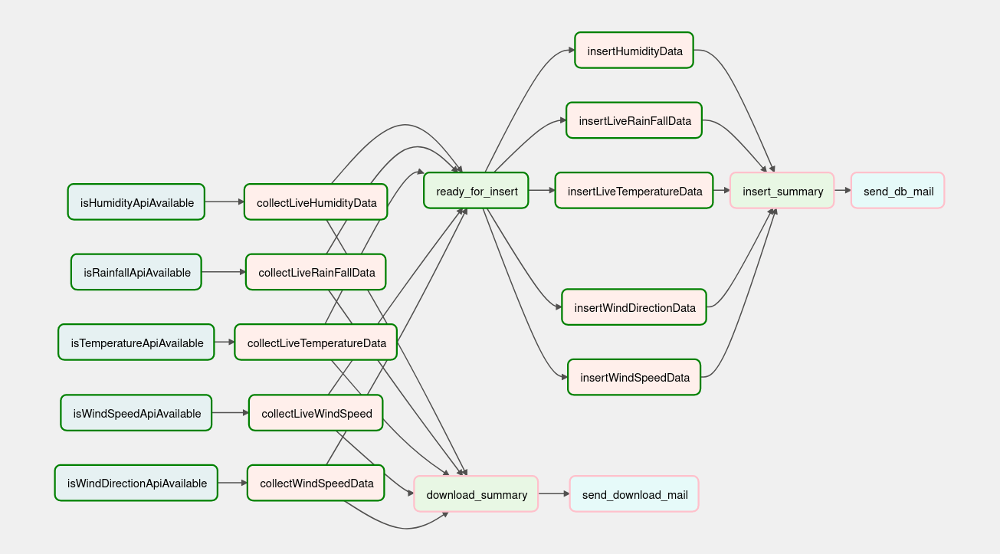

## General Information

This is a project demonstrating building a data pipeline using a task ochestrator "air flow". The application will make api call to Singapore's weather's api that is updated minute by minute and then processing the data to a real-time weather status report. This project mainly focuses on building docker images for newest airflow and its supporting applications. This project aims to simulate the need for data engineering tasks that involve making making api calls to a specific endpoint for data periodically or making regular file downloads to prepare for insert into database or large datasets processing that requires spark cluster to support its data processing capability.

Airflow is a platforms that allows the engineer to define tasks as DAG (directed Acyclic Graph) that consists of multiple operators. The inbuilt dashboard allows for real-time monitoring of tasks as well as notification emails to be sent to the engineer when the task is completed or failed.

Airflow support 3 kinds of executors: SequentialExecutor, LocalExecutor and CeleryExecutor. The original docker-compose file was set to use Celery Executor to support horizontal scaling. However, due to the lack of computing power on my laptop, running CeleryExecutor is too taxing. SequentialExecutor is out of the question because it does not support parallelism. Hence, LocalExecutor is selected for a more lightweight airflow application.

The following shows one of the dags:

Lets imagine there is 5 sources of data to collect. In order to collect them, we check if api endpoint is available, then download the files. When all files are successfully downloaded, the task to insert to database will be triggered. If any of the task fails, the dag will send a email stating at which part of the pipeline fails.

Future Extension:
If the data processing jobs get large, there is a possibility of incorporating local spark cluster to use it to process the data and still using airflow to introduce some monitoring capability.

This will be a matter of connecting the local spark cluster to airflow and writing another processing file using python. The SparkSubmitOperator will be used to submit the spark job written in python.

## Technology Used
- Python 3.8
- airflow 2.2.3
- docker 20.10.7
- postgresql 13 for airflow metadata
- postgresql 14 for local database

## Authors
Me only.

## Install
Installation instructions:
1) clone git repository.
2) Ensure that docker and docker-compose is installed on your os. 
3) docker-compose -f docker-compose.yml up -d 
4) To bring your container down: docker-compose -f docker-compose.yml down

Some useful commands to check docker container's status:
1) docker ps : to list all running docker container and check on its health.

## COPYING/ LICENSING
Copyrights goes to airflow and docker since this data pipeline application is built with these 2 technologies as base technologies. Data comes from an open-source api and can be found in dags/weather/urls.py

